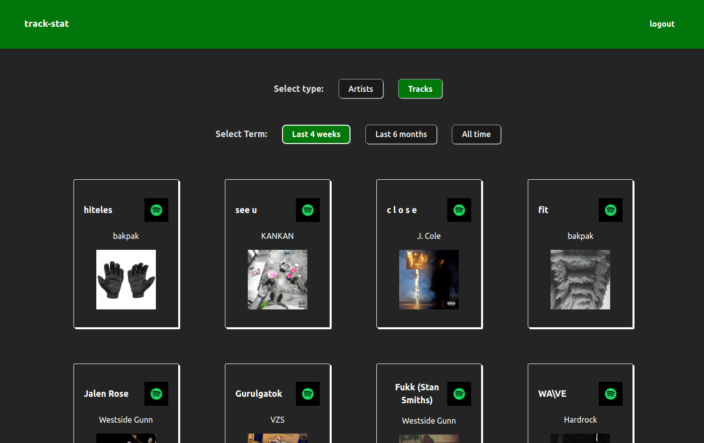
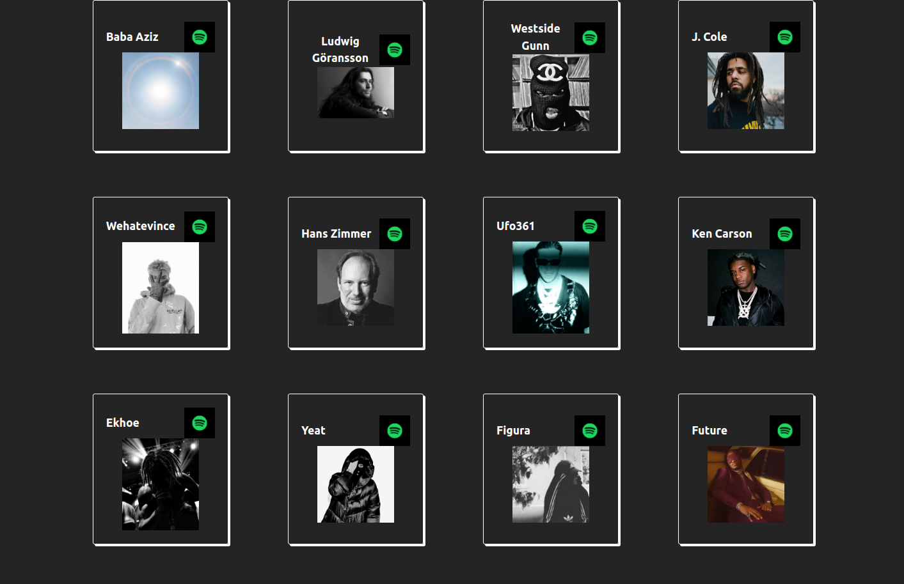

# track-stats

A React project made using the [Spotify API](https://developer.spotify.com/documentation/web-api).

After signing in you can view your top tracks and artists in the last 4 weeks, 6 months or all time.

**You can check out the working [demo here](https://track-stats.vercel.app).**

Screenshots of the current demo:

